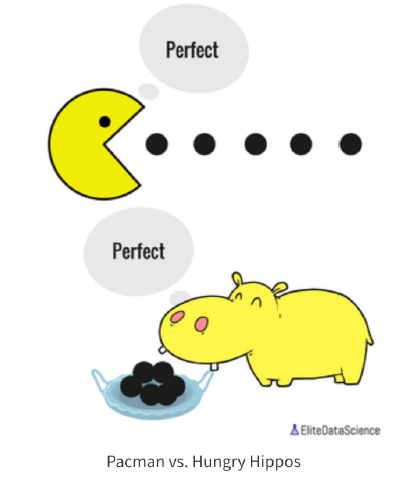

# ProgramEvaluation
 Evaluate two different content delivery programs for a foreign language platform. 

# Background
When you're evaluating programs, it's important to first determine the key metric for the problem. Is your goal to increase test scores, user engagement, or some other KPI? 

For this challenge, our goal will be to maximize user engagement. 
In general, all online learning platforms must figure out how to keep users engaged. Users may have all sorts of other responsibilities and distractions that pull them away. 

One lever that platforms can pull is whether to "drip" lessons or unlock everything at once. 
* Drip programming, e.g. unlocking a new module every week, prevents users from feeling overwhelmed or burnt out. This strategy is usually more effective for progression-based courses with a clear start and end. 
* Binge programming, e.g. unlocking everything from the start, permits users to learn as fast as they want. This strategy is usually more effective for buffet-style courses. 
Both programs have their advantages and disadvantages. 

## How to Use
The Installation process will get you a copy of the project up and running on your local machine for development and testing purposes
1. Clone or download the project into your local machine.
2. Unzip the project folder.
3. Open the source file [Program Evaluation](ProgramEvaluation-UserEngagement.ipynb) using [JypyterNotebook](http://jupyter.org/) and execute the file.

## Repository Contains
 - Data -- Contains the raw data folder
 - Images -- Folder contains the images used in python notebook 
 - Problem Statement -- Case Study Business Problem Statement

If there are any issues in the code, raise them [here](https://github.com/Niranjankumar-c/PriceOptimization/issues)

## Author
- Connect with me on [linkedin](https://www.linkedin.com/in/niranjankumar-c/).
- Follow me on medium for blogs related to machine learning & deeplearning: 
    - https://towardsdatascience.com/@niranjankumarc
    - https://hackernoon.com/@niranjankumarc

### License
The code and files in this repository is made available for free released under [MIT](LICENSE).
